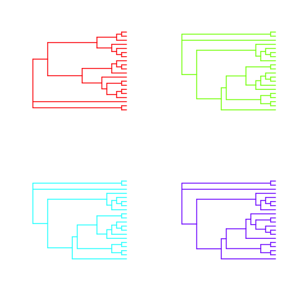
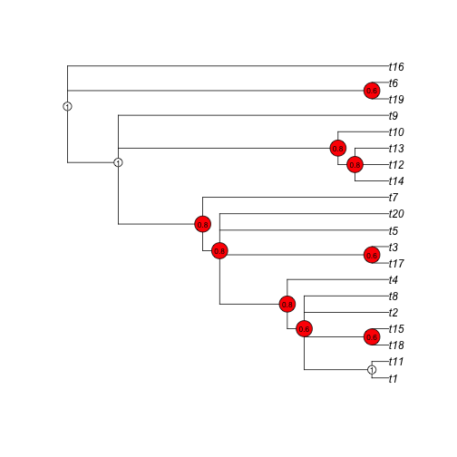
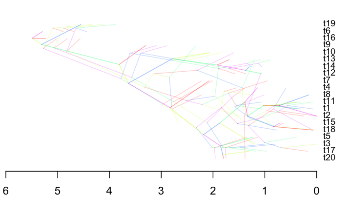
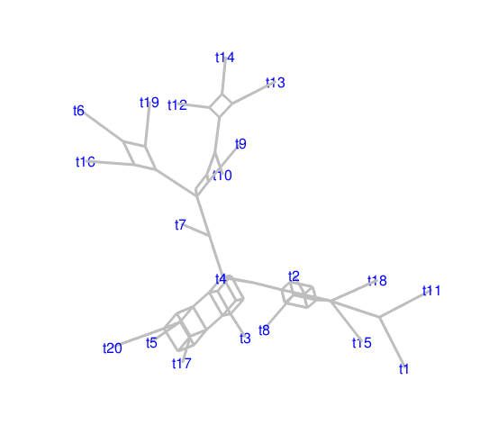
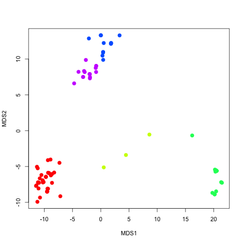
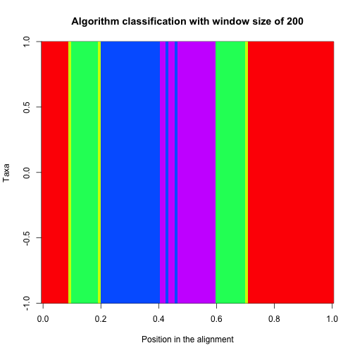
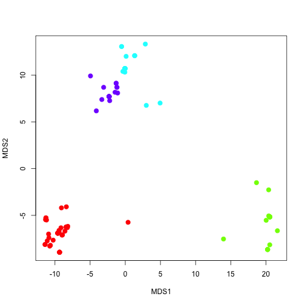

Clustering method for recombination detection
=============================================

August 4 2014

This method uses a sliding window across sites in an alignment. For each window it estimates a neighbour-joining tree. The next step is to estimate the Branch Score Distance ([Penny and Hendy 1985](#references)) for all pairs of trees. This metric only consideres topology and it naturally adjusts to polytomies, but it does not consider branch lengths. This is an important requirement because sections of the genome that have the same evolutionary history can have different rates, or be subject to different selective constraints.

The distances between trees can be used to represent the space of tree topologies in the alignment, which can be visualized with a multidimensional scaling (MDS) algorithm. If there is no recombination, the topologies for all trees should be very similar, although it some incongruence is expected due to stochastic variation along the sequences. In the presence of recombination between lienages, there should be as many topologies as there are recombination events. This would result in several clusters of trees in the tree topology space. A **cluster** is a portion of the alignment with that follows a single evolutionary history, with no recombination. The clusters of trees can be identified using discrete clustering method or other unsupervised learning algorithms. For the purpose of this example I use the Gap statistic, which has worked well in other projects that used tree distances.

This method has some advantages over other phylogenetic approaches to detect recombination:

- It does not require a reference sequence because it is not based on sequence similarity.

- It uses the relative distances between trees to find clusters, so it is not necessary to test congruence of topologies with likelihood or other statistical methods.

- It is not necessary to assume a species tree topology *a priori*. Each tree from different portions of the data set can have a different topology.

- It can be easily optimised for large data sets by using faster clustering algorithms, such as CLARA, and parallelising some of the steps. However, the example below is quite slow because it is written in R and it uses many dependencies.

- It is possible to use other tree distance metrics to determine whether non-recombinig regions have similar rates of evolution, and whether they are under similar selective constraints across the taxa of interest (Snir et al. 2014; Du et al. 2013).

It is necessary to test the method further, but it has some clear limitations: 

- Phylogenetic methods using sliding windows infer recombination breakpoints. To trace the recombination events it would be necessary to inspect the different gene trees. A visual tool is to plot phylogenetic networks or DensiTree objects.

- The tree topology space can be very small if there are few taxa. This will hinder the performance of the clustering algorithm. One potential solution is to include the patterns of among-lineage rate variation into the distance metric (similar to [ClockstaR](https://github.com/sebastianduchene/clockstar/)).

- It is difficult to detect recombination break-points in along lineages that are close to the terminal branches. These events might have a similar pattern to that of stochastic variation in the topology.

- It is not clear whether the method is robust to different values of the window size, which needs to be specified by the user. In the example below, a small window size resulst in some false positives. This can potentially be automated by optimising the window size that yields the most cohesive clusters, but this has the risk of producing spurious results. An other potential solution is to start with a large window size and to reduce its size for regions that have a large proportion of unresolved nodes, similar to simulated annealing in MCMC sampling techniques.

Possible future developments

- Implement tree comparissons to determine recombining lineages or taxa.

- The simulations below assume different evolutionary histories, but they do not explicitly simulate recombination. This is necessary to test the method under a more realistic scenario.


Example of the method on simulated data
--------------------------------------

Load required packages:


```r
library(phangorn)
library(NELSI)
library(cluster)
```

Simulate a set of trees to represent the different evolutionary histories. This is done by nearest-neighbour-interchange to represent recent recombination events, and subtree prune and regafting to represent recombination more basal lineages.


```r
set.seed(1234)
tr1 <- unroot(rtree(20))
set.seed(4321)
tr2 <- rSPR(tr1, moves = 6)
set.seed(10000)
tr3 <- rNNI(tr2, moves = 2)
set.seed(6789)
tr4 <- rNNI(tr3, moves = 10)
tr5 <- tr4
```

Note that tree 5 (tr5) and tree 4 are identical (tr4), so the data set should have four recombination breakpoints. In this example I simulate 10 nucleotide alignments, with 2 alignments per tree. The trees can be stored in a list of 'gene trees' to simulate the sequence data.


```r
gene_trees <- list(tr1, tr1, tr2, tr2, tr3, tr3, tr4, tr4, tr5, tr5)
```

The gene trees are shown below. The colours correspond to the clusters that the algorithm sholud detect:


```r
par(mfrow = c(2, 2))
for(i in 1:4){
  plot((gene_trees[[i+1]]), edge.width = 2, edge.col = rainbow(4)[i], show.tip.label = F, use.edge.length = F)
}
```

 

The consensus of the gene trees can be inspected to determine the sections of the tree that are poorly resolved, possibly due to recombination events.


```r
con_tree <- unroot(consensus(gene_trees, p = 0.5))
par(mfrow = c(1, 1))
pclades <- prop.clades(con_tree, gene_trees)/ 10
plot(con_tree)
nodelabels(pclades, frame = 'cir', cex = 0.7, bg = c('red', 'white')[(pclades == 1) + 1])
```

 

The consensus tree can also be represented as a densiTree:


```r
class(gene_trees) <- 'multiPhylo' 
densiTree(gene_trees)
```

```
## no input starting tree or option for optim.parsimony; using random addition tree
```

```
## Final p-score 268 after  1 nni operations
```

```
## The MRP supertree, optimized via optim.parsimony(),
## has a parsimony score of 268 (minimum 180)
```

 


```r
consensusNet(gene_trees)
```

 


I simulate 10 alignments for the gene trees. In each case I multiply the branch lengths of the tree by absolute values of a random normal variatble. This is to create different levels sequence divergence.


```r
sim_dat <- list()
for(i in 1:10){
  tr_temp <- gene_trees[[i]]
  tr_temp$edge.length <- abs(rnorm(37, 0.03, 0.1))
#  print(sum(tr_temp$edge.length))
  sim_dat[[i]] <- as.DNAbin(simSeq(tr_temp))
}
```

The alignments are concatenated to represent the assembled genomes of the 20 taxa. I shuffle the alignments so that some regions that are not contiguous have the same evolutionary history. For example, 'genes' 2 and 1 have the same evolutionary history, but theywere simulated under the same tree 

```r
gene_order <- c(10, 2, 3, 4, 5, 6, 1, 7, 8, 9)
sim_dat <- sim_dat[gene_order]

concat_dat <- sim_dat[[1]]
for(i in 2:length(sim_dat)){
  concat_dat <- cbind(concat_dat, sim_dat[[i]])
}
```
I define a couple of useful functions. get_sw_range defines the ranges of the windows along the alignment. get_tree_pair_dist is used to estimate the pairwise distances between trees.


```r
###########
# Functions

get_sw_range <- function(l_data, w_size, move_size){
  w_ranges <- matrix(data = c(1, w_size), 1, 2)
  end_dat <- 0
  start_row <- 1
  while(end_dat < length(l_data)){
    next_w <- w_ranges[start_row, ] + move_size
    w_ranges <- rbind(w_ranges, next_w)
    end_dat <- max(w_ranges)
    start_row <- start_row + 1
  }
  w_ranges[nrow(w_ranges), ncol(w_ranges)] <- length(l_data)
  rownames(w_ranges) <- paste0('window_', 1:nrow(w_ranges))
  return(w_ranges)
}

get_tree_pair_dist <- function(trees_list){
  dist_mat <- matrix(NA, nrow = 1, ncol = length(trees_list))
  for(i in 2:length(trees_list)){
#    print(paste('estimating distances for', i))
    trees_range <- 1:(i-1)
    tree_dist_temp <- sapply(trees_list[trees_range], function(x) dist.topo(trees_list[[i]], x))
    dist_mat <- rbind(dist_mat, c(tree_dist_temp, rep(NA, ncol(dist_mat) - length(tree_dist_temp))  ))
  }
  return(dist_mat)
}
#########
```

Now I use the functions above to obtain the trees for windows in the alignment and to estimate the tree distances. I chosse a window size of 500 with moves of 100.


```r
range_200 <- get_sw_range(1:ncol(concat_dat), 200, 100)

w_trees <- list()

for(i in 1:nrow(range_200)){
      dat_temp <- concat_dat[, range_200[i, 1]:range_200[i, 2]]  
      w_trees[[i]] <- NJ(dist.logDet(phyDat(dat_temp)))
      w_trees[[i]]$edge.length <- NULL
}

w_dist <- get_tree_pair_dist(w_trees)
```

I use the PAM algorithm and the Gap statistic to find the optimal number of clusters. One problem of this approach is that it does not use the distance matrix directly. This can be overcome by using the multidimensional scaling (MDS) of the data, at the cost of losing some of the variation. This can be checked by inspecting the eigenvalues of the MDS (which is not shown for this example).


```r
w_scale <- cmdscale(as.dist(w_dist))
w_clust <- clusGap(w_scale, pam, K.max = 7)
```

```
## Clustering k = 1,2,..., K.max (= 7): .. done
## Bootstrapping, b = 1,2,..., B (= 100)  [one "." per sample]:
## .................................................. 50 
## .................................................. 100
```

```r
k_clust <- pam(w_scale, k = maxSE(w_clust$Tab[, 3], w_clust$Tab[, 4]))
data_clustered <- cbind(range_200, k_clust$clustering)
```

Visualise the MDS of the tree distances. The points are the trees for every window slide. The colours are their corresponding clusters.


```r
plot(w_scale, pch = 20, col = rainbow(max(k_clust$clustering))[k_clust$clustering], ylab = 'MDS2', xlab = 'MDS1', cex = 2)
```

 

The results can be shown by plotting a matirx of the clustering assignment. The colours correspond to those of the MDS and they represent the tres in along the alignment. The rows would represent the taxa, while the colums are the position in the original alignment:

```r
image(as.matrix(data_clustered[, 3]), col = rainbow(max(k_clust$clustering)), ylab = 'Taxa', xlab = 'Position in the alignment', main = 'Algorithm classification with window size of 200')
```

 

The simulated data can also be shown for comparisson. This is the expected result if the algorithm detected recombination break-points with out error: 

```r
image(as.matrix(c(rep(1, 10), rep(2, 10), rep(3, 20), rep(4, 20), rep(2, 10), rep(1, 20), rep(1, 10))), col = rainbow(max(k_clust$clustering)), ylab = 'Taxa', xlab = 'Position in the alignment', main = 'Simulated data')
```

 


There are a few incorrect classifications. The number of trees is also higher than the simulated. This may be improved with a larger window size. This is done by the user, but some automated procedures may work better.


```r
range_250 <- get_sw_range(1:ncol(concat_dat), 250, 100)

w_trees <- list()

for(i in 1:nrow(range_250)){
      dat_temp <- concat_dat[, range_250[i, 1]:range_250[i, 2]]  
      w_trees[[i]] <- NJ(dist.logDet(phyDat(dat_temp)))
      w_trees[[i]]$edge.length <- NULL
}

w_dist <- get_tree_pair_dist(w_trees)
w_scale <- cmdscale(as.dist(w_dist))

w_clust <- clusGap(w_scale, pam, K.max = 7)
```

```
## Clustering k = 1,2,..., K.max (= 7): .. done
## Bootstrapping, b = 1,2,..., B (= 100)  [one "." per sample]:
## .................................................. 50 
## .................................................. 100
```

```r
k_clust <- pam(w_scale, k = maxSE(w_clust$Tab[, 3], w_clust$Tab[, 4]))
data_clustered <- cbind(range_250, k_clust$clustering)
plot(w_scale, pch = 20, col = rainbow(max(k_clust$clustering))[k_clust$clustering], ylab = 'MDS2', xlab = 'MDS1', cex = 2)
```

 

```r
image(as.matrix(data_clustered[, 3]), col = rainbow(max(k_clust$clustering)), ylab = 'Taxa', xlab = 'Position in the alignment', main = 'Algorithm classification with window size of 250')
```

 

```r
image(as.matrix(c(rep(1, 10), rep(2, 10), rep(3, 20), rep(4, 20), rep(2, 10), rep(1, 20), rep(1, 10))), col = rainbow(max(k_clust$clustering)), ylab = 'Taxa', xlab = 'Position in the alignment', main = 'Simulated data')
```

 

Although it still misclassifies some sites, it has fewer errors.


References
----------

Penny, D. and Hendy, M. D. (1985) The use of tree comparison metrics. Systematic Zoology, 34, 75-82.

Snir, S., Wolf, Y. I., & Koonin, E. V. (2014). Universal pacemaker of genome evolution in animals and fungi and variation of evolutionary rates in diverse organisms. Genome biology and evolution, 6(6), 1268-1278.

Du, X., Lipman, D. J., & Cherry, J. L. (2013). Why Does a Protein’s Evolutionary Rate Vary over Time?. Genome biology and evolution, 5(3), 494-503.
